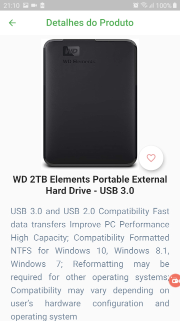
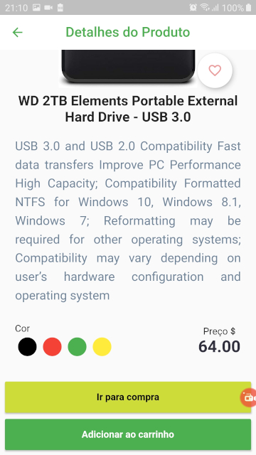
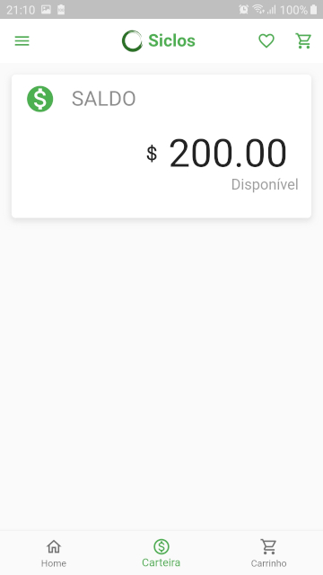

# Siclos

Drummond group

## Getting Started

It is a Drummond spin-off focused on the development of solutions focused on the area financial. The Siclos platform will be a financial solution, focused on payroll loans and prepaid payment methods for Drummond group employees and partners. In backend uses Python with the Django + Rest Framework, docker + docker-compose, Postgres database.

## Warmup:
---
- User needs to view partner product list;
- User needs to view product details;
- User needs to view the cart;
- User needs to view the quantity of products in the cart;
- User needs to make the purchase;
- User needs to view my account.

1. The system must contain 3 tabs: Home - list of products; Portfolio - balance available and loan amount received; and Basket - products added to the shopping basket;
2. The list of items can be populated by an added list directly in the code or through some API;
3. The product list must contain: image, name and price;
4. In item 2, it can be the click and any of the product attributes or on a specific button;
5. In item 4, the number of items in the cart should be shown on the screen initial and must be updated according to the selected product;
6. In item 5, in the cart area, have a button to "save", the amount must be removed from the balance and the extra amount must be saved as a loan;
7. In item 6, by default the user has an opening balance of R $ 200. area you only need to show the current balance and the loan amount accomplished.
---
## For solution:

For the solution, the following packages will be used:

- [flutter_native_splash 0.1.9](https://pub.dev/packages/flutter_native_splash)
- [flutter_launcher_icons 0.7.5](https://pub.dev/packages/flutter_launcher_icons)
- [mockito 4.1.2](https://pub.dev/packages/mockito)
- [modular_codegen 2.0.0+1](https://pub.dev/packages/modular_codegen)
- [mobx_codegen 1.1.0+1](https://pub.dev/packages/mobx_codegen)
- [build_runner 1.10.1](https://pub.dev/packages/build_runner)
- [flushbar 1.10.4](https://pub.dev/packages/flushbar)
- [shared_preferences_web 0.1.2+7](https://pub.dev/packages/shared_preferences_web)
- [shared_preferences 0.5.10](https://pub.dev/packages/shared_preferences)
- [extended_image 1.1.1](https://pub.dev/packages?q=extended_image)
- [dio 3.0.10](https://pub.dev/packages/dio)
- [flutter_mobx 1.1.0+2](https://pub.dev/packages/flutter_mobx)
- [mobx 1.2.1+2](https://pub.dev/packages/mobx)
- [flutter_modular 2.0.0+1](https://pub.dev/packages/flutter_modular)

## Screenshots:

|Lista de produtos|Detalhes do produto 1|Detalhes do Produto 2|
|-|-|-|
| | | |
| Saldo| Carrinho | Empréstimo |
| | ||

# Siclos

Drummond group

## Getting Started

It is a Drummond spin-off focused on the development of solutions focused on the area financial. The Siclos platform will be a financial solution, focused on payroll loans and prepaid payment methods for Drummond group employees and partners. In backend uses Python with the Django + Rest Framework, docker + docker-compose, Postgres database.

## Warmup:
---
- User needs to view partner product list;
- User needs to view product details;
- User needs to view the cart;
- User needs to view the quantity of products in the cart;
- User needs to make the purchase;
- User needs to view my account.

1. The system must contain 3 tabs: Home - list of products; Portfolio - balance available and loan amount received; and Basket - products added to the shopping basket;
2. The list of items can be populated by an added list directly in the code or through some API;
3. The product list must contain: image, name and price;
4. In item 2, it can be the click and any of the product attributes or on a specific button;
5. In item 4, the number of items in the cart should be shown on the screen initial and must be updated according to the selected product;
6. In item 5, in the cart area, have a button to "save", the amount must be removed from the balance and the extra amount must be saved as a loan;
7. In item 6, by default the user has an opening balance of R $ 200. area you only need to show the current balance and the loan amount accomplished.
---
## For solution:

For the solution, the following packages will be used:

- [flutter_native_splash 0.1.9](https://pub.dev/packages/flutter_native_splash)
- [flutter_launcher_icons 0.7.5](https://pub.dev/packages/flutter_launcher_icons)
- [mockito 4.1.2](https://pub.dev/packages/mockito)
- [modular_codegen 2.0.0+1](https://pub.dev/packages/modular_codegen)
- [mobx_codegen 1.1.0+1](https://pub.dev/packages/mobx_codegen)
- [build_runner 1.10.1](https://pub.dev/packages/build_runner)
- [flushbar 1.10.4](https://pub.dev/packages/flushbar)
- [shared_preferences_web 0.1.2+7](https://pub.dev/packages/shared_preferences_web)
- [shared_preferences 0.5.10](https://pub.dev/packages/shared_preferences)
- [extended_image 1.1.1](https://pub.dev/packages?q=extended_image)
- [dio 3.0.10](https://pub.dev/packages/dio)
- [flutter_mobx 1.1.0+2](https://pub.dev/packages/flutter_mobx)
- [mobx 1.2.1+2](https://pub.dev/packages/mobx)
- [flutter_modular 2.0.0+1](https://pub.dev/packages/flutter_modular)

## Screenshots:

|Lista de produtos|Detalhes do produto 1|Detalhes do Produto 2|
|-|-|-|
| | | |
| Saldo| Carrinho | Empréstimo |
| | ||

## Video demo:

